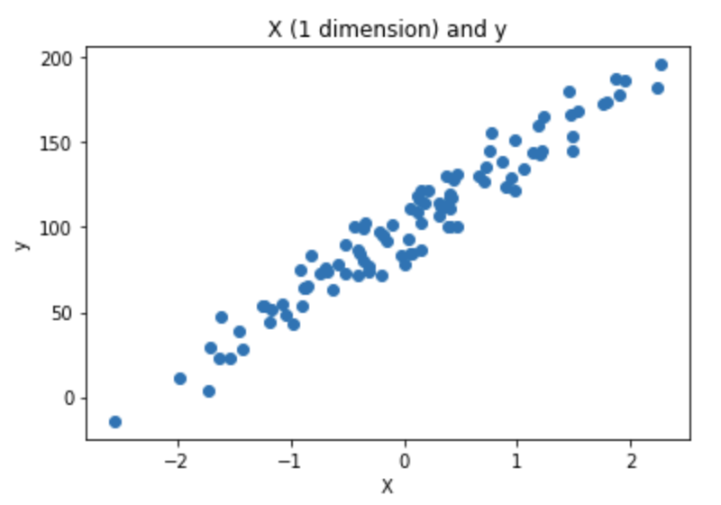
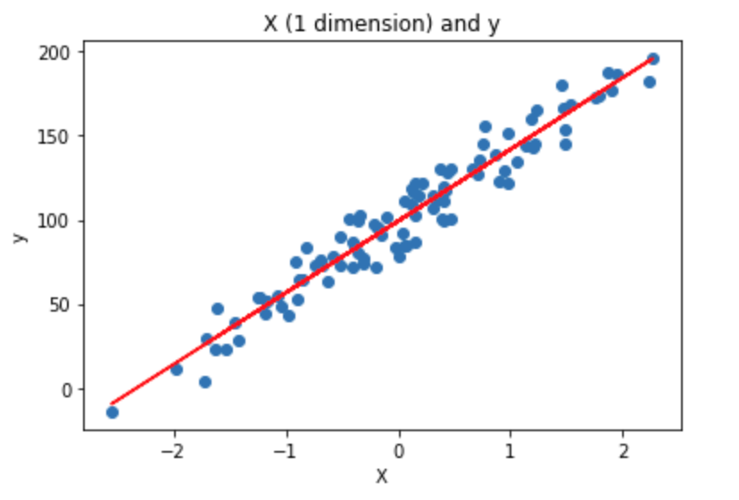
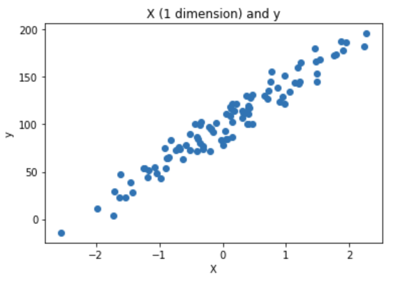
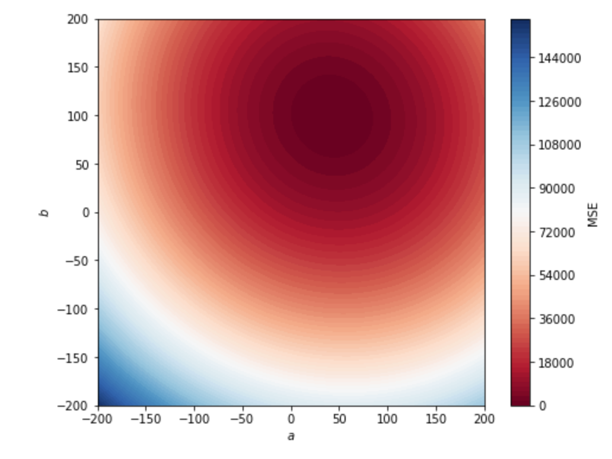
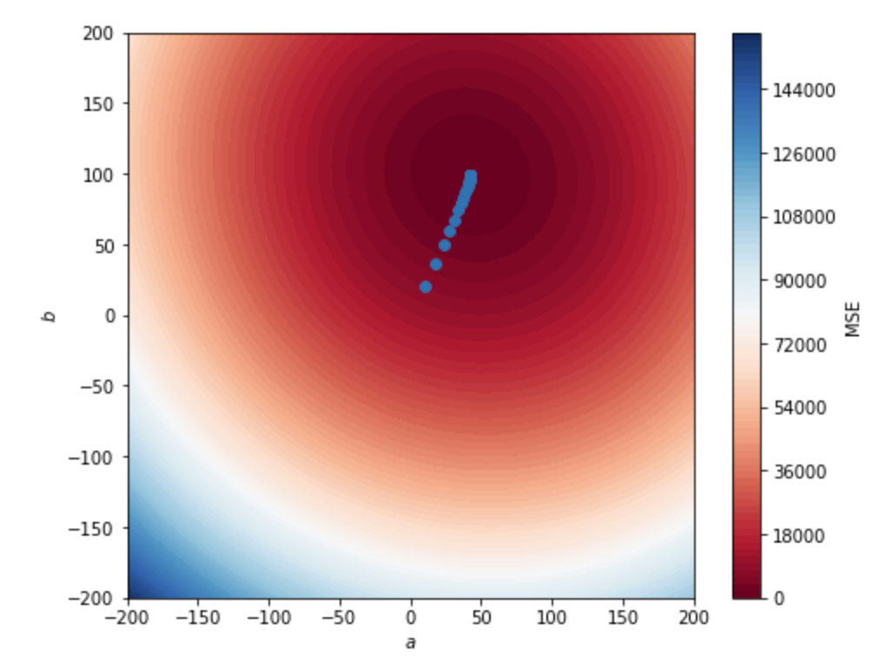

## Linear regression

### Overview


The goal of this quest is to understand practical linear regression and supervised learning with Scikit-learn.

The word "regression" was introduced by Sir Francis Galton (a cousin of C. Darwin) when he
studied the size of individuals within a progeny. He was trying to understand why
large individuals in a population appeared to have smaller children, closer to the average population size; hence the introduction of the term "regression".

### Learning Objectives

- **Implement** linear regression models using Scikit-learn for supervised learning tasks.
- **Split** datasets into training and testing sets for proper model evaluation.
- **Evaluate** regression model performance using metrics such as MSE.
- **Understand** gradient descent optimization for finding optimal coefficients.
- **Apply** linear regression to real-world datasets like diabetes progression forecasting.

### Submission Structure

```
ex00/
├── requirements.txt
└── Notebook_ex00.ipynb (or ex00.py)
ex01/
└── ex01.py (or Notebook_ex01.ipynb)
ex02/
└── ex02.py (or Notebook_ex02.ipynb)
ex03/
└── ex03.py (or Notebook_ex03.ipynb)
ex04/
└── ex04.py (or Notebook_ex04.ipynb)
ex05/
└── ex05.py (or Notebook_ex05.ipynb)
```

**File Descriptions:**

- `requirements.txt` - Python packages with versions (ex00 only)
- Solution files - Either `.py` scripts or `.ipynb` notebooks

**Note:** Learners may submit solutions as either `.py` Python scripts or `.ipynb` Jupyter notebooks.

### Virtual Environment

- Python >= 3.9
- NumPy
- Pandas
- Matplotlib
- Scikit-learn
- Jupyter or JupyterLab

_Version of Scikit-learn used to do the exercises: 0.22_. We suggest using the most recent one. Scikit-learn 1.0 is available.

---

---

### Exercise 0: Environment and libraries

The goal of this exercise is to set up the Python work environment with the required libraries.

**Note:** For each quest, your first exercise will be to set up the virtual environment with the required libraries.

We recommend using:

- The **latest stable versions** of Python.
- The virtual environment you're the most comfortable with. `virtualenv` and `conda` are the most used in Data Science.
- One of the most recent versions of the required libraries

1. Create a virtual environment named `ex00`, with a version of Python >= `3.9`, with the following libraries: `pandas`, `numpy`, `jupyter`, `matplotlib` and `scikit-learn`.

---

### Exercise 1: Scikit-learn estimator

The goal of this exercise is to learn to fit a Scikit-learn estimator and use it to predict.

```console
X, y = [[1],[2.1],[3]], [[1],[2],[3]]
```

1. Fit a LinearRegression model from Scikit-learn with X the features and y the target and predict for `x_pred = [[4]]`

2. Print the coefficients (`coefs_`) and the intercept (`intercept_`), the score (`score`) of the regression of X and y.

---

---

### Exercise 2: Linear regression in 1D

The goal of this exercise is to understand how the linear regression works in one dimension. To do so, we will generate data in one dimension. Using `make_regression` from Scikit-learn, generate a dataset with 100 observations:

```python
X, y, coef = make_regression(n_samples=100,
                         n_features=1,
                         n_informative=1,
                         noise=10,
                         coef=True,
                         random_state=0,
                         bias=100.0)
```

1. Plot the data using matplotlib. The plot should look like this:



2. Fit a LinearRegression from Scikit-learn on the generated data and give the equation of the fitted line. The expected output is: `y = coef * x + intercept`

3. Add the fitted line to the plot. The plot should look like this:



4. Predict on X.

5. Create a function that computes the Mean Squared Error (MSE) and compute the MSE on the dataset. _The MSE is frequently used as well as other regression metrics that will be studied later this week._

   ```
   def compute_mse(y_true, y_pred):
       #TODO
       return mse
   ```

   Change the `noise` parameter of `make_regression` to 50

6. Repeat question 2, 4 and compute the MSE on the new data.

---

---

### Exercise 3: Train test split

The goal of this exercise is to learn to split a dataset. It is important to understand why we split the data into two sets. To put it in a nutshell: the Machine Learning model learns on the training data and evaluates on data the model has not seen before: the test data.

```python
X = np.arange(1,21).reshape(10,-1)
y = np.arange(1,11)
```

1. Split the data using `train_test_split` with `shuffle=False`. The test set represents 20% of the total size of the dataset. Print X_train, y_train, X_test, y_test.

---

---

### Exercise 4: Forecast diabetes progression

The goal of this exercise is to use Linear Regression to forecast the progression of diabetes. It will not always be specified; you should perform an exploratory data analysis to gain a good understanding of the data you are modeling. As a reminder here is an introduction to EDA:

```python
from sklearn.datasets import load_diabetes
diabetes = load_diabetes(as_frame=True)
X, y = diabetes.data, diabetes.target
```

1. Using `train_test_split`, split the dataset in a train set, and test set (20%). Use `random_state=43` for results reproducibility.

2. Fit the Linear Regression on all the variables. Give the coefficients and the intercept of the Linear Regression. What is the equation ?

3. Predict on the test set. Predicting on the test set is like having new patients for whom, as a physician, you need to forecast the disease progression in one year given the 10 baseline variables.

4. Compute the MSE on the train set and test set. Later this week we will learn about the R2 which will help us to evaluate the performance of this fitted Linear Regression. The MSE returns an arbitrary value depending on the range of error.

**WARNING**: This will be explained later this week. But here, we are doing something "dangerous". As you may have read in the data documentation the data is scaled using the whole dataset whereas we should first scale the data on the training set and then use this scaling on the test set. This is a toy example, so let's ignore this detail for now.

---

---

### Exercise 5: Gradient Descent (Bonus)

The goal of this exercise is to understand how the Linear Regression algorithm finds the optimal coefficients.

The goal is to fit a Linear Regression on a one dimensional features data **without using Scikit-learn**. Let's use the dataset we generated for the exercise 2:

```python
X, y, coef = make_regression(n_samples=100,
                         n_features=1,
                         n_informative=1,
                         noise=10,
                         coef=True,
                         random_state=0,
                         bias=100.0)
```

_Warning: The shape of X is not the same as the shape of y. You may need (for some questions) to reshape X using: `X.reshape(1,-1)[0]`._

1. Plot the data using matplotlib:



As a reminder, fitting a Linear Regression on this data means finding (a, b) that fits well the data points.

- `y_pred = a*x +b`

Mathematically, it means finding (a, b) that minimizes the MSE, which is the loss used in Linear Regression. If we consider 3 data points:

- `Loss(a,b) = MSE(a,b) = 1/3 *((y_pred1 - y_true1)**2 + (y_pred2 - y_true2)**2 + (y_pred3 - y_true3)**2)`

and we know:

y_pred1 = a*x1 + b\
y_pred2 = a*x2 + b\
y_pred3 = a\*x3 + b

#### Greedy approach

2. Create a function `compute_mse`. Compute mse for `a = 1` and `b = 2`.
   **Warning**: `X.shape` is `(100, 1)` and `y.shape` is `(100, )`. Make sure that `y_preds` and `y` have the same shape before to compute `y_preds-y`.

```python
def compute_mse(coefs, X, y):
    '''
    coefs is a list that contains a and b: [a,b]
    X is the features set
    y is the target

    Returns a float which is the MSE
    '''

    #TODO

    y_preds =
    mse =

    return mse
```

3. Create a grid of **640000** points that combines a and b with. Check that the grid contains 640000 points.

- a between -200 and 200, step= 0.5
- b between -200 and 200, step= 0.5

This is how to compute the grid with the combination of a and b:

```python
aa, bb = np.mgrid[-200:200:0.5, -200:200:0.5]
grid = np.c_[aa.ravel(), bb.ravel()]
```

4. Compute the MSE for all points in the grid. If possible, parallelize the computations. It may be needed to use `functools.partial` to parallelize a function with many parameters on a list. Put the result in a variable named `losses`.

5. Use this chunk of code to plot the MSE in 2D:

```python
aa, bb = np.mgrid[-200:200:.5, -200:200:.5]
grid = np.c_[aa.ravel(), bb.ravel()]
losses_reshaped = np.array(losses).reshape(aa.shape)

f, ax = plt.subplots(figsize=(8, 6))
contour = ax.contourf(aa,
                    bb,
                    losses_reshaped,
                    100,
                    cmap="RdBu",
                    vmin=0,
                    vmax=160000)
ax_c = f.colorbar(contour)
ax_c.set_label("MSE")

ax.set(aspect="equal",
    xlim=(-200, 200),
    ylim=(-200, 200),
    xlabel="$a$",
    ylabel="$b$")
```

The expected output is:



6. From the `losses` list, find the optimal value of a and b and plot the line in the scatter point of question 1.

In this example we computed 160 000 times the MSE. It is frequent to deal with 50 features, which requires 51 parameters to fit the Linear Regression. If we try this approach with 50 features we would need to compute **5.07e+132** MSE. Even if we reduce the scope and try only 5 values per coefficients we would have to compute the MSE **4.4409e+35** times. This approach is not scalable and that is why it is not used to find optimal coefficients for Linear Regression.

#### Gradient Descent

In a nutshell, gradient descent is an optimization algorithm used to minimize some function by iteratively moving in the direction of steepest descent as defined by the negative of the gradient. In machine learning, we use gradient descent to update the parameters (a and b) of our model. Parameters refer to the coefficients used in Linear Regression.

7. Implement gradient descent to find optimal a and b with `learning rate = 0.1` and `nbr_iterations=100`.

8. Save the a and b through the iterations in a two-dimensional numpy array. Add them to the plot of the previous part and observe a and b that converge towards the minimum. The plot should look like this:



9. Use Linear Regression from Scikit-learn. Compare the results.

### Tips

1. **Always split your data:** Never train and test on the same data; use train_test_split to ensure unbiased model evaluation.

2. **Understand the math:** Linear regression finds the best-fit line by minimizing MSE - knowing this helps debug and improve models.

3. **Check for linear relationships:** Use scatter plots to verify that features have linear relationships with the target before applying linear regression.

4. **Scale features when needed:** Features with different ranges can affect gradient descent convergence - consider standardization for real-world data.

5. **Start simple:** Begin with one feature to understand the model, then add complexity - interpretability is key in linear regression.

### Resources

**Scikit-learn Basics:**

- [Getting Started with Scikit-learn](https://scikit-learn.org/stable/getting_started.html) - Official quickstart guide
- [Introducing Scikit-learn](https://jakevdp.github.io/PythonDataScienceHandbook/05.02-introducing-scikit-learn.html) - Python Data Science Handbook chapter
- [Linear Models in Scikit-learn](https://scikit-learn.org/stable/modules/linear_model.html) - Complete reference for linear regression

**Linear Regression Fundamentals:**

- [Linear Regression Introduction](https://onlinestatbook.com/2/regression/intro.html) - Statistical foundations
- [Everything About Linear Regression](https://www.analyticsvidhya.com/blog/2021/10/everything-you-need-to-know-about-linear-regression/) - Comprehensive guide

**Machine Learning Courses:**

- [Andrew Ng's ML Course](https://www.youtube.com/playlist?list=PLWD7QtH5pagQevEwjEOCQi1Cgqe3zKf2s) - Classic Stanford course

**Datasets:**

- [Diabetes Dataset](https://scikit-learn.org/stable/datasets/toy_dataset.html#diabetes-dataset) - Documentation for Exercise 4

### AI Prompts For Learning

1. "Explain the difference between training error and testing error in machine learning. Why do we need to split data, and what problems occur if we don't? Include examples of overfitting and underfitting."

2. "How does gradient descent work in linear regression? Explain the role of learning rate, the gradient calculation, and why it's more efficient than trying all possible coefficient combinations. Include the mathematical intuition."
